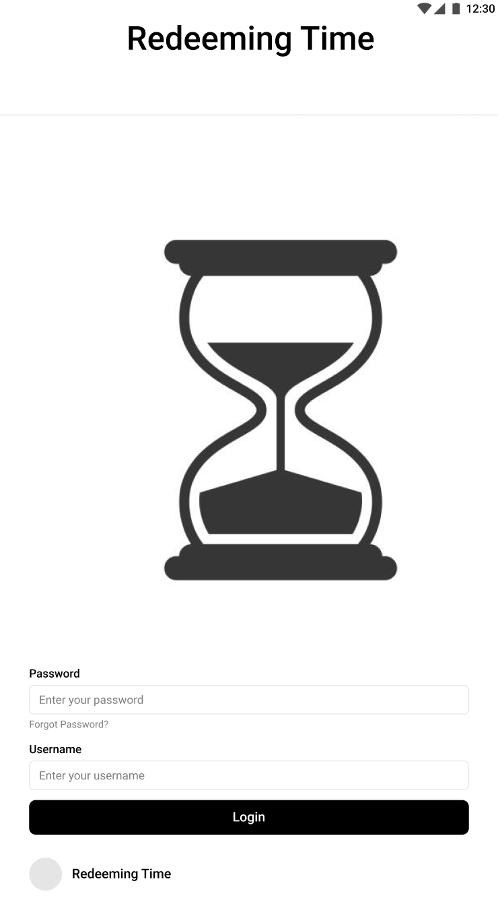
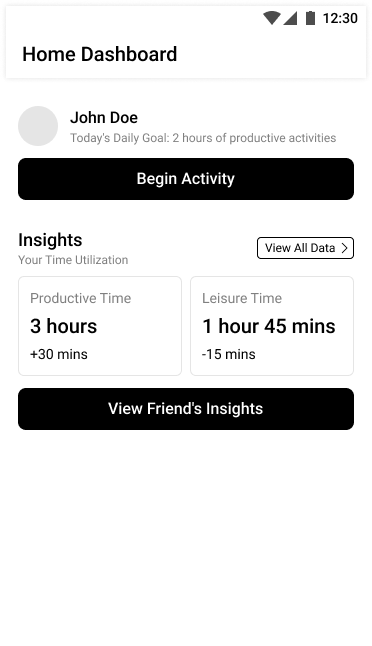
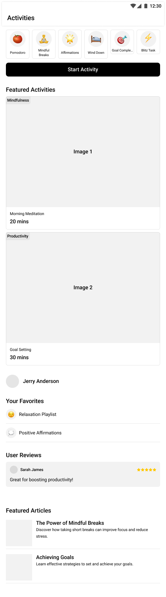
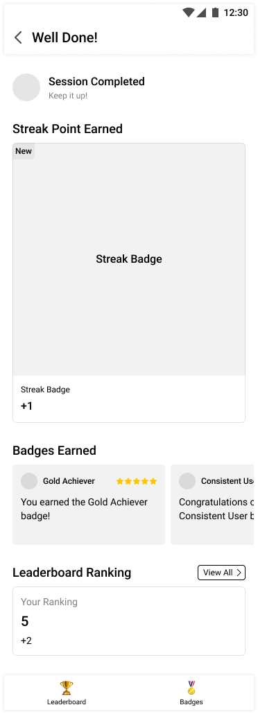

# Phase II: Refining interaction and designing wireframes

## Introductions

Following Phase I is competitive and heuristic evaluation. Our team identified key opportunities for improving productivity apps through personalized motivation and intentional time use. In Phase II, our focus shifted toward validating our initial design through cognitive walkthroughs and informal usability feedback. This allowed us to evaluate the understanding of user flows, identify ambiguous elements, and refine our wireframes based on real-world observations and persona-based scenarios. Our main goal was to ensure the interface supports users in achieving meaningful, distraction-free engagement with their time.

## Methods

We conducted two independent cognitive walkthroughs using our Phase I wireframes and the "Jerry Anderson" persona. Two external evaluators, David Carbajal and Gibson Smith, were each given a written persona profile and scenario describing Jerry's background as a remote freelancer who struggles with time management and seeks to reduce social media distractions through intentional, goal-oriented activity. Using only the persona, scenario, and wireframes, each evaluator independently explored the app's flow without guidance from our team.

### Step-by-Step Walkthrough Using Wireframes

#### Step 1: Login Screen  

Both evaluators began at the login screen, where they were prompted to enter credentials. While the screen was generally clear, Gibson pointed out that the order of the fields—password first, then Username—felt backward and inconsistent with user expectations. This indicated a mild usability issue with learned patterns of interaction.

#### Step 2: Home Dashboard  

After logging in, users landed on the dashboard. This screen summarizes productive vs. leisure time, daily goal tracking, and a button to begin an activity. Both evaluators correctly identified the "Begin Activity" button and appreciated the inclusion of insights. However, neither clearly understood what would happen next or how "View Friend's Insights" functioned, showing a need for more clarity or hover-text on secondary options.

#### Step 3: Activities Page  

Clicking "Begin Activity" led users to the activities screen. Here, featured activities are displayed alongside favorites, user reviews, and articles. David expressed confusion over the meaning of "User Reviews" and "Favorites"—he was not sure if they referred to media playlists or saved tasks. Gibson highlighted that the "Start Activity" interaction lacked feedback; it was unclear when an activity officially started or what it entailed. He suggested breaking this interaction into smaller steps, including a description and confirmation page.

#### Step 4: Completion & Feedback  

Once an activity is marked as complete, users land on a results screen that displays earned badges, a leaderboard ranking, and motivational feedback. Both evaluators found the rewards system (badges, streaks) motivating, especially for users like Jerry, who benefit from structured accountability. This screen successfully communicated a sense of achievement, though users still wanted confirmation when a session started—not just when it ended.

While the evaluators were not formally instructed to answer the four standard cognitive walkthrough questions, we analyzed their feedback using the following framework:
1. Will the user know what to do at this step?
2. Will the user notice that the correct action is available?
3. Will the user associate the correct action with the desired outcome?
4. If the correct action is performed, will the user see that progress is being made toward the goal?

This approach allowed us to extract valuable usability insights from observed behavior without over-structuring the evaluation process. Each wireframe step highlighted real pain points, misinterpretations, and strengths in our initial design, which directly informed our refinements.

## Findings

From the walkthroughs, we discovered several usability concerns and opportunities for design improvement. On the login screen, one evaluator noted the reversed order of input fields—password before username—as a slight but noticeable deviation from standard patterns. Although this did not break functionality, it introduced a slight hesitation in form interaction. This issue highlighted the importance of following conventional field ordering, especially on initial screens.

On the dashboard, both evaluators understood the general purpose of the screen and correctly identified the "Begin Activity" button; however, the lack of explanation or preview for what would happen next created uncertainty. Similarly, the "View Friend's Insights" feature lacked contextual clarity, prompting users to question what type of comparison they would see or why it was useful.
 
The activities screen caused more confusion since there was no explanation. Terms like "User Reviews" and "Favorites" were misinterpreted, with evaluators unsure if they referred to playlists, media, or saved tasks. Additionally, the process of starting an activity lacked any feedback or confirmation. It was not clear whether pressing "Start Activity" meant the activity had begun, needed to be tracked manually, or would trigger some timer. This ambiguity posed a significant barrier to first-time users.
 
The final screen—completion and rewards—was well received. Both evaluators liked using badges, streaks, and leaderboard feedback as motivational tools. These elements aligned well with Jerry's persona, which needs external motivation to build consistent habits. However, one recurring issue was the absence of a clear indication of when a session began. Users appreciated the completion screen but still felt unsure about the beginning of the activity flow.

## Conclusions
Based on the walkthroughs and the feedback received about the layout of our application, there is a deviation from expected interactions, a lack of feedback disrupting the user's experience, and a lack of clarification with contextual cues. In our application, the logic order was reversed. The password was requested before the username, which led to the user hesitating due to confusion. From this feedback, we learned that users focus on familiar patterns through their experience with other applications. The login screen has been updated to follow a more conventional order, with the username before the password, to prevent confusion and hesitation and give the user a better experience. 

The feedback also addressed navigating the activities screen. They could not determine when an activity had begun or what to expect after tapping "Start Activity." Since there was no direct feedback, the users could not enjoy their experience. To improve this, we are specifying the labels of each button to inform the user better. On the activities screen, clarifying labels and terms, for example, "User Reviews" to "Activity Feedback" and explaining that "Favorites" refers to saved activities, not media, will provide clarity to each activity and its purpose.
Additionally, by breaking the "Start Activity" flow into a multi-step interaction, users will now view a brief activity description and confirm they are ready to begin. Upon pressing "Start," a subtle animation or timer will indicate that the session is in progress. We are still exploring ways to create a smoother transition into that screen to make the entire activity journey—from start to finish—intentional.  

## Caveats
While the feedback was informative, our walkthrough relied on only two external evaluators. A small sample size does not fully grasp the experience of a broader and more diverse user. A greater sample size would lead to more experiences and feedback covering different issues and other tasks we must focus on. Additionally, since the walkthrough was based on static wireframes rather than interactive prototypes, issues that may occur during animations, transitions, or timing would not be relayed back to us. There was no real-time observation nor interviews, so we couldn't see emotional responses, thought processes, or moments of stress. Therefore, our understanding of why misunderstandings occur is unknown. 

Our evaluation was also limited to the "Jerry Anderson" persona as a remote freelancer struggling with focus and time management. While this was useful for validating specific task flows, additional testing using the "Sarah James" persona—or new personas altogether—would help ensure our app is accessible and meaningful to different user types. Some issues may have gone unnoticed or underemphasized since the evaluators were not instructed to use formal usability heuristics or frameworks. 

