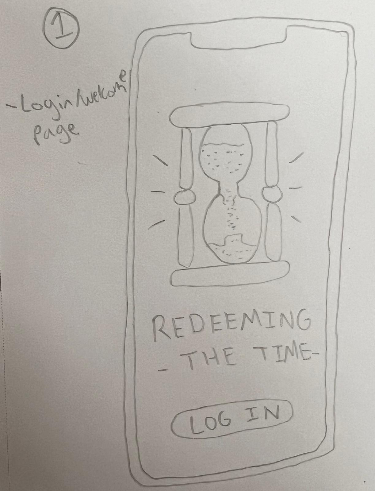
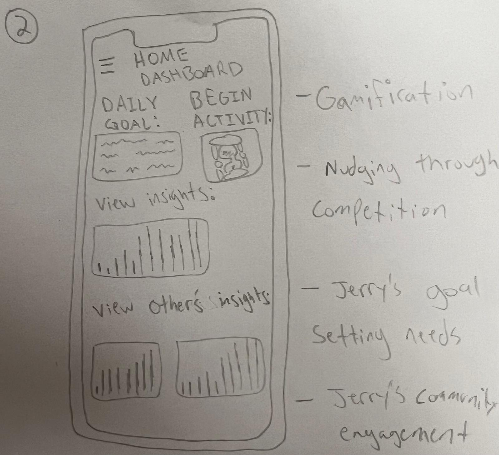
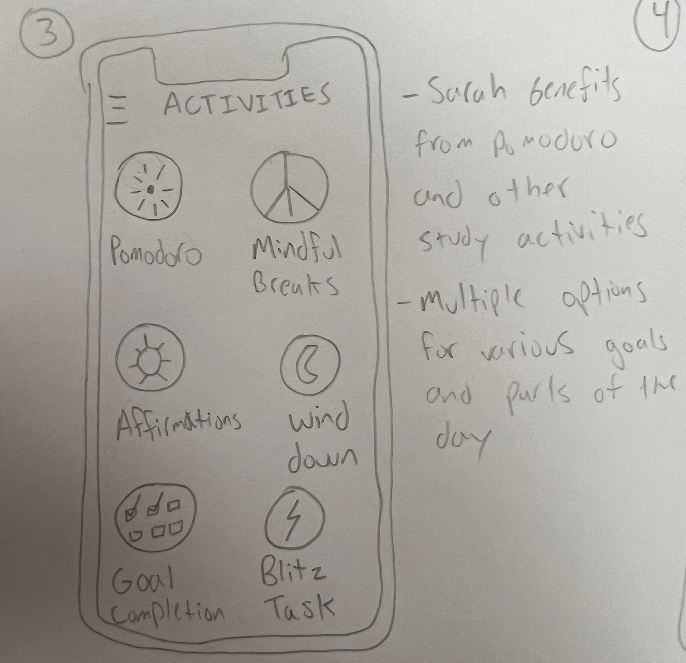
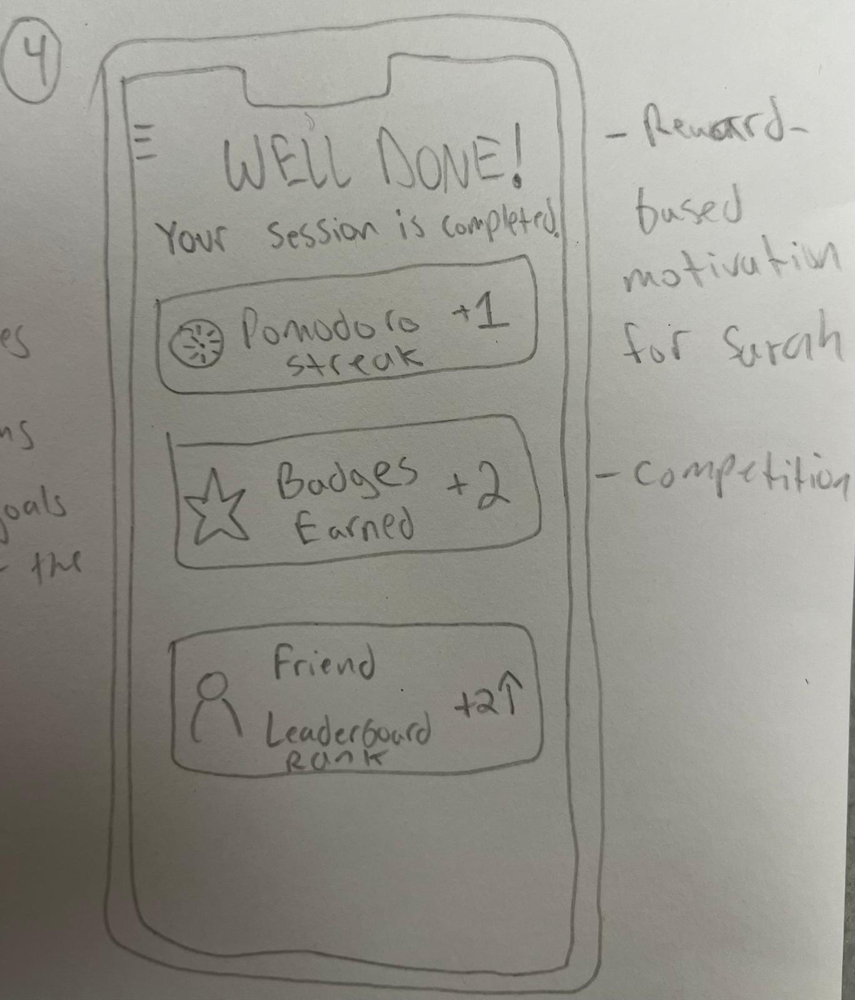

# Sketches  

##   
### Initial Login Page of the App  

---

##   
### Home Dashboard  
- Includes **Daily Goal, Begin Activity, View Insights, and View Others’ Insights**.  
- Designed to **gamify** the experience for users who thrive on competition and reward-based activities.  
- Viewing **friends’ progress and insights** can motivate users to stay engaged.  
- The layout is **simple and minimalistic** to avoid overwhelming users while still providing meaningful options.  

---

##   
### Activities Selection  
- Offers various activities such as:  
  - **Pomodoro** – Focused work sessions  
  - **Mindfulness Break** – Short relaxation exercises  
  - **Affirmations** – Positive reinforcement statements  
  - **Wind Down** – Pre-sleep routine  
  - **Goal Completion** – Task tracking and achievement  
  - **Blitz Task** – Quick productivity bursts  
- Designed to integrate into different parts of the user’s day, making the app useful beyond just one session.  

---

##   
### Activity Summary & Rewards  
- Provides a **summary of the completed activity**.  
- Implements **reward-based progress tracking** for users motivated by incentives.  
- Features **leaderboards and rankings** against friends to encourage friendly competition and consistent participation.  

---
