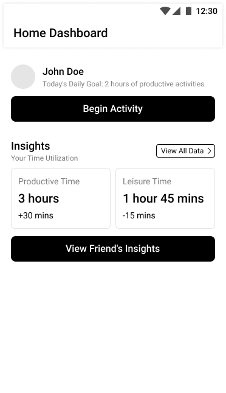
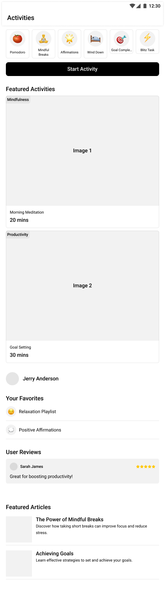
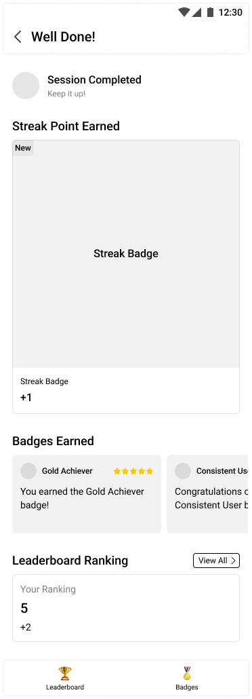

# Wireframes

### Login Page  
- This is the entry point for users to access the app.  
- Includes fields for **username and password**, with a “Forgot Password?” link for recovery.  
- A clean, minimal design that introduces the **Redeeming Time** brand with a centered hourglass icon.

---

### Home Dashboard  
- Displays the user's **daily goal** and provides an option to **Begin Activity**.  
- Shows **time insights**, tracking both **productive time** and **leisure time** with helpful deltas (+/- indicators).  
- Includes a button to **view friends’ insights**, promoting social motivation and accountability.

---

### Activities Selection Screen  
- Lists activity options including: **Pomodoro, Mindful Breaks, Affirmations, Wind Down, Goal Completion, Blitz Task**.  
- Features **user favorites, recent activity history, reviews**, and **featured articles**.

---

### Completion & Rewards Screen  
- Displays session feedback after completing an activity:  
  - **Streak points**  
  - **Badges earned**  
  - **Leaderboard ranking**  
- Reinforces positive behavior and encourages repeat engagement through **gamification**.  

---
